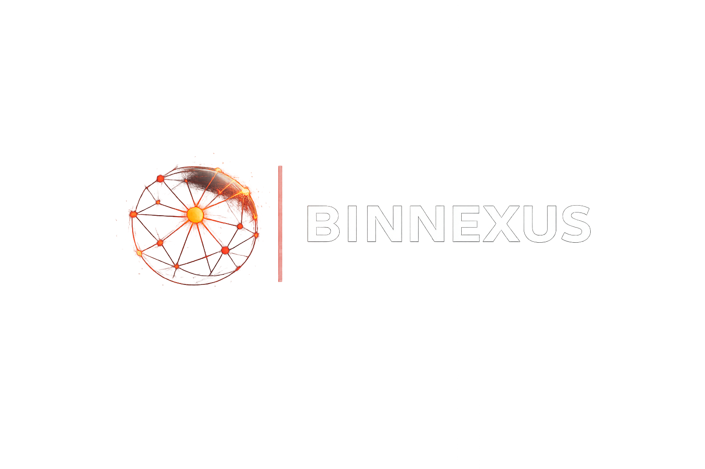

  <strong>Binary Dependency Graph & Export Explorer for Windows (x86)</strong>

  
  
  
  

  

---

---

<strong>Язык:</strong>

  🇷🇺 Русский (текущий)

|
<a href="./README.md">
  🇺🇸 English
</a>

---

BinNexus — инструмент для анализа бинарников Windows (DLL / EXE), который строит **интерактивный веб-портал** с графом зависимостей и исследованием экспортов.

Он позволяет перейти от набора файлов к пониманию **структуры системы**.

Как выглядит:
https://dvurechensky.github.io/Freelancer.Reverse.Runtime/

---

- [Возможности](#возможности)
  - [Dependency Graph](#dependency-graph)
  - [Export Explorer](#export-explorer)
  - [Global Search](#global-search)
  - [Noise Filtering](#noise-filtering)
- [Как это работает](#как-это-работает)
- [Быстрый старт](#быстрый-старт)
- [Требования](#требования)
- [Ограничения](#ограничения)
- [Назначение](#назначение)
- [Примечания](#примечания)

## Возможности

### Dependency Graph

- визуализация связей между DLL и EXE
- выявление центральных узлов системы
- быстрый анализ архитектуры

### Export Explorer

- список экспортов с адресами
- поддержка undecorated символов
- фильтрация:
  - all
  - reverse

### Global Search

- поиск по:
  - DLL
  - символам
  - undecorated именам
  - адресам

### Noise Filtering

- исключение:
  - CRT (msvcrt)
  - WinAPI
  - системных DLL
  - forward exports

---

## Как это работает

1. Сканируется директория с DLL / EXE
2. Извлекаются:
   - imports (через dumpbin)
   - exports (через pefile)
3. Формируется граф зависимостей
4. Генерируется HTML-портал

---

## Быстрый старт

См. 👉 [Сборка & Запуск (Windows)](docs/BUILD.ru.md)

---

## Требования

- Windows
- Visual Studio / Build Tools
- Python 3.10+

---

## Ограничения

- только статический анализ
- отсутствует call graph
- отсутствует анализ логики функций

---

## Назначение

BinNexus решает задачу:

> быстро понять структуру бинарного приложения до этапа дизассемблирования

---

## Примечания

> [!TIP]
> Используйте x86 Native Tools для анализа legacy-приложений — это даст корректные результаты dumpbin.

> [!WARNING]
> Запуск вне Developer Command Prompt приведёт к отсутствию dumpbin и ошибкам анализа imports.

> [!NOTE]
> Системные DLL намеренно исключаются для уменьшения шума и повышения читаемости графа.

---

<h3 align="center">✨Dvurechensky✨</h3>
